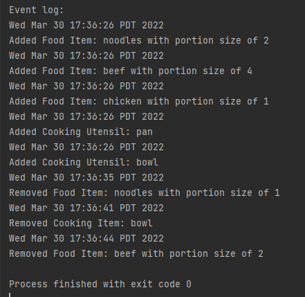
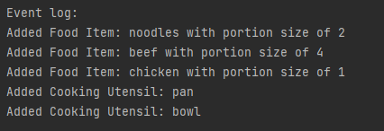

# My Personal Project

## A meal suggester

**What will the application do?**

The application will generate a list of possible meals that the user can cook
given their circumstances with regards to the ingredients and cooking utensils they have. They can
also input their own custom recipes which will also show up in the list of generated possible meals
they can produce given proper ingredients and cooking utensils.

**Who will use it?**

This application is tailored to anyone who wants to cook with no limit being placed due to experience.
Clear recipe instructions (well hopefully) will aid users in making their desired meal.

**Why is this project of interest to you?**

Imagine you're a novice cook, wanting to try your hand in the kitchen for once. But you take a look at the fridge and
think to yourself "What can I even make with these ingredients? I've never cooked in my life before!". So you try to google
online what meals you can make, only to end up wasting hours and not finding one that you can make. Well, admittedly, I've never experienced this feeling
before (maybe you have), but I do occasionally have bouts when I just want to learn how to cook meals with what I have around me, 
and thus, with some inspiration from the edx project description, I 
came up with the idea of making a recipe generator.

*How it works*:
- **User** inputs list of available food items.
- **User** inputs list of available cooking utensils.
- **App** returns a list of possible meals to choose from.

##*User Stories*

1. As a user, I want to be able to add a food item to the list of available food items.
2. As a user, I want to be able to add a cooking utensil to the list of available cooking utensils.
3. As a user, I want to add a customizable recipe to the list of recipes.
4. As a user, I want to be able to see the list of available recipes I have to work with given the input of food items and cooking utensils.
5. As a user, I want to be able to select a certain recipe and view the instructions to make the meal.
6. As a user, I want to be able to remove a food item from the list of available food items.
7. As a user, I want to be able to remove a cooking utensil from list of cooking utensils.
8. As a user, I want to be able to view the lists of items that I've added currently.
9. As a user, I want to be able to save my inputted lists of food and cooking utensils (user info).
10. As a user, I want to be able to load my previously saved inputted lists of food and cooking utensils (user info).

##*Phase 4: Task 2*

**Without Time Stamps:** 

##*Phase 4: Task 3*

*Reflection*

If I had more time I:
- Would refactor code in MealSuggesterApp to remove duplication of actions
which of the only difference pertains to whether the item is a CookingUtensil and FoodItem so that code is more 
readable, organized and prepared for future additions of more functionality.
- Would implement a better Singleton Design for the Database, templating off EventLog as current one may not be the most
optimal. After doing so I would remove the dependencies on the database from UserInfo and MealSuggesterApp to 
lower coupling.
- Would implement an Observer design method for updating UI, so that whenever something relevant to the UI
is changed, the visuals themselves would update. This would replace the current strategy of calling multiple 
methods in different places for each refresh (eg. refreshing output panel and display panel separately) and allow 
for future additions to be easily added as another observer, instead of having to create a new method that refreshes
the addition.
- Would refactor code to improve cohesion in UserInfo Class (Create an ingredient manager that handles
adding, removing, and storing food and a utensil manager that handles adding, removing, and storing cooking items)
so that everything is more organized and makes more sense and so that each class specifies in an action, adhering to the 
Single responsibility principle. This would also minimize coupling.
- Would make database store a list of items, instead of a list of string that stores item names. This may eventually lead
to a design where new Items would not be needed to be instantiated else and only referenced from Database which may 
increase performance using sets. Would be used like a dictionary. Overall not very necessary from a design point but
would be my preferred way of implementing database.
- Would store food items, cooking utensils, and recipes in Sets instead of Lists as the order of which the items are
  added does not matter and there should be no duplicates.
- Would find a way to refactor code in App, as there are many functions that are similar to each other (adding food and
adding cooking utensil/removing food item and removing cooking utensil). Doing this will make code cleaner, more
readable and organized.
- Would implement functionality for creating custom recipes on the GUI.

